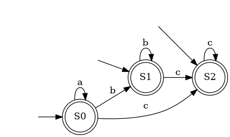

Реагируйте, регулярное выражение `a*b*c*` на конечных автоматах.

### Шаг 0
Нарисуем граф переходов.


В нашем случае любая вершина стартовая и терминальная одновременно.

### Шаг 1
Составим таблицу.

|  \  |  a  | b  |   c |
|:---:|:---:|:---:|:---:|
| S0  | S0  | S1  | S2  |
| S1  |     | S1  | S2  |
| S2  |     |     | S2  |

### Шаг 2
Запишем это на языке программирования
```python
TRANSITIONS = {
    "S0": {"a": "S0", "b": "S1", "c": "S2"},
    "S1": {           "b": "S1", "c": "S2"},
    "S2": {                      "c": "S2"}
}
START_STATE = {"a": "S0", "b": "S1", "c": "S2"}
END_STATE = {"S0", "S1", "S2"}
```

### Шаг 3
Обойдем граф

```python
input = "abc"
i = 0
state = "S0"
while i < len(input):
    state = TRANSITIONS[state][input[i]]; i += 1


print(i)
print(state in END_STATE)
```

### Шаг 4
Обернем это в функцию и добавим обработку ошибок

```python
def match(input):
    if input[0] not in START_STATE: return False

    i = 0
    state = START_STATE[input[i]]
    while i < len(input):
        if state not in TRANSITIONS: return False
        if input[i] not in TRANSITIONS[state]: return False

        state = TRANSITIONS[state][input[i]]; i += 1
    return state in END_STATE


assert match("aaaabbcccc")
assert not match("e")
assert not match("bca")
print("LOL! It works!")
```

### Задание
Постройте конечные автоматы (руками) и напишите код для других несложных регулярных выражений.

Например
* `a+b+c+`
* a+(b|c)*
* и т.д.

В построении графов вам может помочь
[fsm_simulator](http://ivanzuzak.info/noam/webapps/fsm_simulator/)

Попробуйте написать программу, которая построит таблицу переходов по заданному регулярному выражению
(начните с простого, например только с `*`). 
